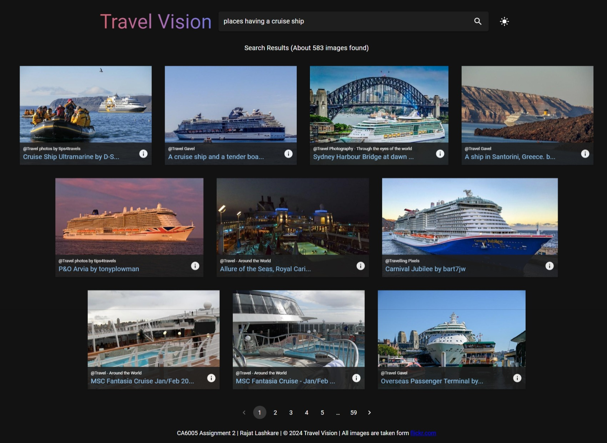
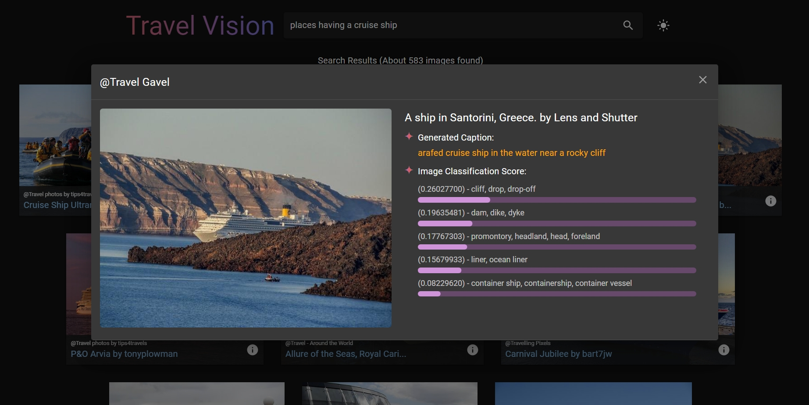
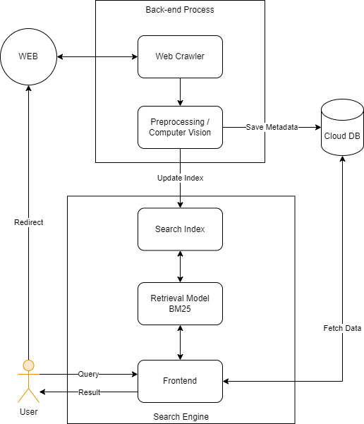

# CA6005 - Mechanics of Search
## Travel Vision: A Prototype Image Search Engine for Travel Enthusiasts

---

---

---

### Project Background:
The project aims to develop a prototype image search engine called "Travel Vision" using web scraping techniques, computer vision models, and information retrieval algorithms. The system is designed to gather travel-related images from an image hosting website, annotate them using computer vision tools, index them using the BM25 retrieval model, and provide a user-friendly web interface for searching and browsing travel images.

### System Architecture:

### Dataset:
The project utilizes images scraped from a image hosting website, focusing on travel-related groups and collections. The dataset comprises thousands of images along with metadata such as image titles, descriptions, and group names. The collection process is done using `backend/data_collection.ipynb` file. The images are not uploaded here due to large size.

### Computer Vision Models:
The system utilizes [Google's VIT](https://huggingface.co/google/vit-base-patch16-224) for image classification and [Salesforce's BLIP](https://huggingface.co/Salesforce/blip-image-captioning-large) models for image captioning to enrich image metadata. These models are not uploaded here due to large size.

### Project Structure:
- **Flask App**: Contains Python code for the backend server, responsible for indexing images, processing search queries, and interacting with the retrieval module. [app and backend folders]
  - **Components**:
    - Image indexing and annotation.
    - Implementation of the BM25 retrieval model.
    - API endpoints for search functionality.
    - Firestore integration for storing metadata.

- **React App**: Contains frontend code for the web interface, allowing users to search and browse travel images. [frontend folder]
  - **Components**:
    - Search bar for entering queries.
    - Image grid for displaying search results.
    - Detailed image preview for viewing image metadata.
    - Pagination for navigating through search results.

- **Deployment**:
  - Flask App: Hosted on Google Cloud Run for scalable and managed containerized applications.
  - React App: Hosted on Firebase Hosting for fast and reliable static content delivery.
  - Firestore: Used for storing image metadata and annotations.
  - Google Cloud Storage: Used for storing image thumbnails and static assets.